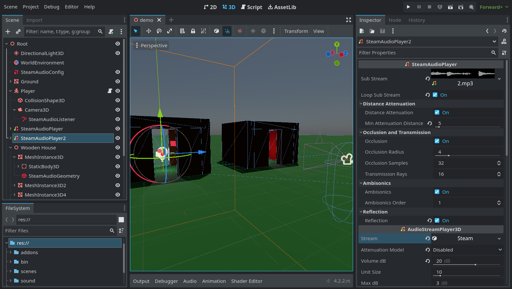

# godot-steam-audio
This is a GDExtension that integrates the [steam-audio](https://valvesoftware.github.io/steam-audio/) library
into Godot 4.2. This adds sound effects such as occlusion and reverb into the engine.

### [Demo Video](https://www.youtube.com/watch?v=vRnzfnb93Gw)

This extension is in a pre-alpha phase, will have bugs and missing polish, and might crash. Linux and Windows
are currently working. Mac probably works, but I don't have the time nor the money to support that, sorry.

### Features 
 - Spatial ambisonics audio 
 - Occlusion and transmission through geometry 
 - Distance attenuation
 - Reflections (reverb)

 To come: 
 - More editor configuration
 - Dynamic geometry
 - Baked scenes for higher-performance reflections
 - More raycasting support

### Getting started
Check [Installation](https://github.com/stechyo/godot-steam-audio/wiki/Installation) for how to install the extension, [Project setup](https://github.com/stechyo/godot-steam-audio/wiki/Project-setup) for how to integrate it with your project, and [Contributing](https://github.com/stechyo/godot-steam-audio/wiki/Contributing) if you're interested in improving the extension.

### Acknowledgements
godot-steam-audio is developed by [stechyo](https://github.com/stechyo).  
Check the [contributors](https://github.com/stechyo/godot-steam-audio/graphs/contributors) for other authors.

godot-steam-audio uses the Steam® Audio SDK. Steam® is a trademark or registered trademark of Valve
Corporation in the United States of America and elsewhere.
Steam® Audio, Copyright 2017 – present, Valve Corp. All rights reserved.

Vespergamedev's [GDNative module](https://github.com/vespergamedev/godot_steamaudio) was helpful in guiding the early development of this extension.

The icons for the SteamAudio nodes are from Godot, with color changes that match one of the colors in
the Steam Deck OLED page. These are MIT-licensed, so they are Copyright (c) 2014-present Godot Engine
contributors.
